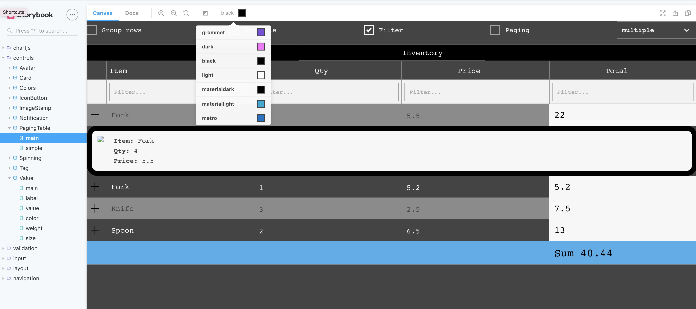

# storybook-addon-grommet

A storybook addon to add a grommet theme selector in the toolbar



## Live demo
[grommet-controls](https://atanasster.github.io/grommet-controls/?path=/story/controls-pagingtable--main)

## Installation
```sh
npm i -D storybook-addon-grommet
```

## Configuration

in the `addons.js` file in your storybook config, register `storybook-addon-grommet`:

```js
import 'storybook-addon-grommet/register'
```

## Usage
In your config.js, define your theme configuration and pass it in to the `addDecorator` function


```javascript
import { addDecorator } from '@storybook/react'; // <- or your storybook framework
import { withGrommet } from 'storybook-addon-grommet';
import { grommet, dark } from 'grommet';
import { black, light, materialdark, materiallight, metro } from 'grommet-controls';

addDecorator(withGrommet({
    theme: 'grommet',
    themes: {
      grommet,
      dark,
      black,
      light,
      materialdark,
      materiallight,
      metro,
    },
    boxProps: {
      align: 'start',
    },
    grommetProps: {
        full: true,
    }
  }
));
```

## Preview
storybook-addon-grommet wraps the preview stories with a `<Grommet />` and a `<Box/>` components which properties are configurable

```
<Grommet theme={themes[state]} {...grommetProps}>
  <Box {...boxProps}>
    {children}
  </Box>  
</Grommet>
```    

## Options


**theme**: initially selected theme<br/>
**themes**: object with keys being the name of the theme and the values being the theme object<br/>
**boxProps**: [`<Box />` properties](https://v2.grommet.io/box)<br/>
**grommetProps**: [`<Grommet />` properties](https://v2.grommet.io/grommet)<br/>


